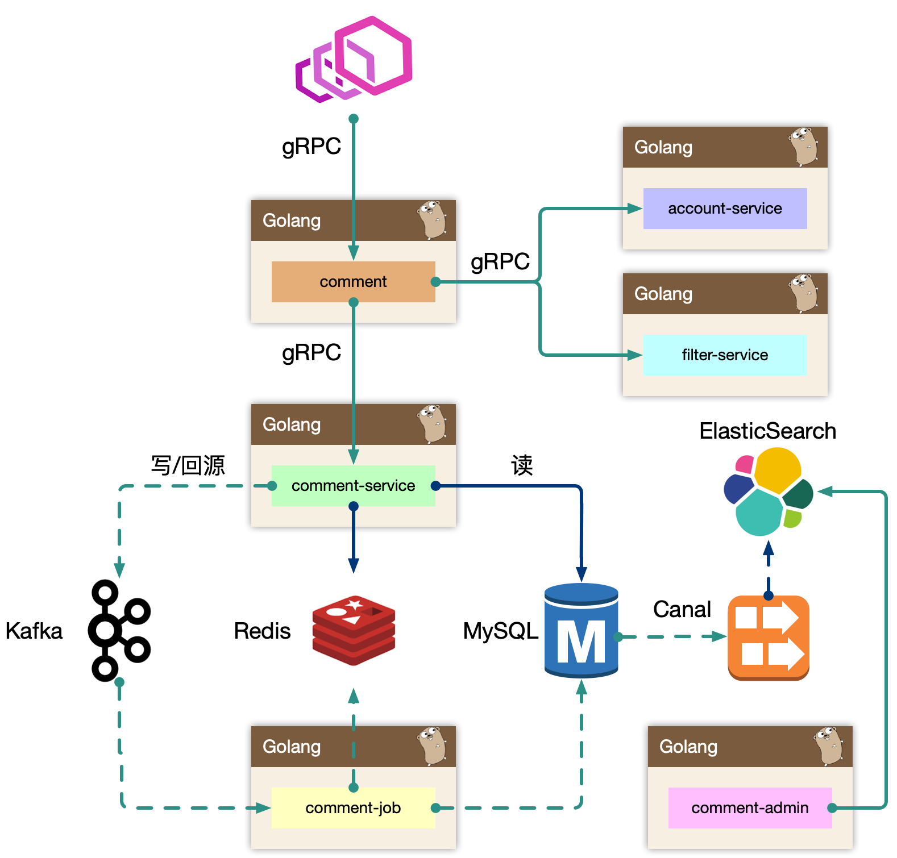

# 评论系统架构设计

## 功能模块

* 发布评论:支持回复楼层,楼中楼
* 读取评论:按照时间热度,排序
* 删除评论:用户删除,作者删除
* 管理评论:作者置顶,后台运营管理(搜索,删除,审核等)

## 架构设计

BFF: comment
Service: comment-service
Job: comment-job
Admin: comment-admin
Dependency: account-service、filter-service

> 架构设计等同于数据设计，梳理清楚数据的走向和逻辑。尽量避免环形依赖、数据双向请求等。

## 存储设计

数据表设计
索引内容分离

## 可用性设计

## References
